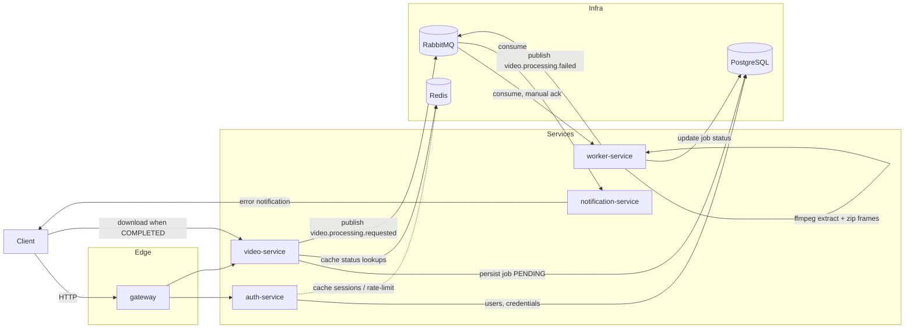

# Architecture

> Status: scaffolding. This document describes the target architecture for the FIAP X
> microservices rewrite. Service implementations land incrementally — see
> [`.ai-agents/PLAN.md`](../.ai-agents/PLAN.md) for the sequenced delivery plan and current
> progress.

## Goal

Replace the monolithic prototype in [`legacy/monolith-reference`](../legacy/monolith-reference)
(a single Gin server that synchronously uploads a video, shells out to `ffmpeg`, zips the frames,
and returns them in one HTTP response) with a set of independently deployable/scalable services
that support authenticated users, durable job persistence, asynchronous processing, horizontal
scaling of the processing tier, and failure notifications.

## Components



- **`gateway`** — single entry point for clients; routes to `auth-service` and `video-service`.
  Reserved for later; scaffolding only in this item.
- **`auth-service`** — registration/login, password hashing, session/token issuance. Owns the
  `users` data in PostgreSQL.
- **`video-service`** — the public video API. Accepts uploads, persists a job row
  (`PENDING`), publishes a processing-requested event to RabbitMQ, and returns immediately rather
  than blocking on `ffmpeg`. Also serves per-user status listing and download once a job is
  `COMPLETED`.
- **`worker-service`** — consumes processing-requested events, runs `ffmpeg` to extract frames,
  zips them, and updates the job's status in PostgreSQL. This is the tier scaled horizontally to
  process multiple videos concurrently.
- **`notification-service`** — consumes processing-failed events and notifies the owning user,
  decoupled from the processing pipeline so notification delivery never blocks `ffmpeg` work.

## Data flow

1. Client authenticates against `auth-service` (username/password) and receives a token.
2. Client calls `video-service` with the token to upload a video.
3. `video-service` validates the token (auth check), persists a job row in PostgreSQL as
   `PENDING`, and publishes a `video.processing.requested` message to RabbitMQ. The HTTP
   response returns immediately — it does not wait for processing.
4. `worker-service` (one or more replicas) consumes the message, downloads/reads the video,
   updates the job to `PROCESSING`, runs `ffmpeg` to extract frames at a fixed rate, and zips the
   output.
5. On success, `worker-service` updates the job to `COMPLETED` and stores a reference to the
   output archive.
6. On failure, `worker-service` updates the job to `FAILED` with an error message and publishes a
   `video.processing.failed` event.
7. `notification-service` consumes the failure event and notifies the user (e.g. email).
8. The client polls `GET /videos` (or `/videos/{id}`) on `video-service` for status, filtered by
   the authenticated user, and downloads the archive once the job is `COMPLETED`.

Redis sits alongside PostgreSQL as a cache for hot reads (status lookups, session/rate-limit
data) so `auth-service` and `video-service` don't need to round-trip to PostgreSQL for every
request; PostgreSQL remains the system of record.

## Technology choices

These decisions are locked for the project; see the ADRs in [`docs/adr/`](adr/) for the reasoning
behind each one.

- **RabbitMQ** for messaging between `video-service`, `worker-service`, and
  `notification-service` — decouples the fast, synchronous upload path from slow `ffmpeg`
  processing, and lets `worker-service` be scaled independently to absorb load spikes without
  dropping requests. See [ADR 0002](adr/0002-rabbitmq-over-kafka.md).
- **PostgreSQL + Redis** for persistence — PostgreSQL is the durable system of record for users
  and jobs; Redis provides a cache layer for hot/read-heavy paths. Both are widely understood,
  operationally simple, and sufficient at this project's scale.
- **Docker Compose** for orchestration — the whole stack (services + infra) needs to run on a
  single developer machine or a single demo host without the operational overhead of a Kubernetes
  cluster. See [ADR 0003](adr/0003-docker-compose-over-k8s.md).
- **Monorepo** layout — all services, shared Go packages, deployment config, and docs live in one
  repository so cross-service changes (e.g. a shared message contract) land in a single commit
  and CI run. See [ADR 0001](adr/0001-monorepo.md).
- **Prometheus + Grafana** for monitoring — each service exposes metrics that Prometheus scrapes;
  Grafana provides dashboards over queue depth, processing throughput, and HTTP performance.
- **GitHub Actions** for CI/CD — lint/test/build pipelines per service, gated on `main`.

## Repository layout

```
/services            Independently deployable Go services (one module each)
  /auth-service
  /video-service
  /worker-service
  /notification-service
/gateway              Edge/API gateway (routing, TLS, shared auth) — reserved
/deploy                Deployment configuration
  docker-compose.yml   Local/demo orchestration of services + infra
  /db                   Database init scripts
  /monitoring           Prometheus + Grafana configuration
/pkg                  Shared Go packages (reserved, empty until services need to share code)
/docs                 Architecture documentation and ADRs
/legacy/monolith-reference  Original prototype, kept for reference only
.github/workflows     CI/CD pipelines
go.work               Go workspace wiring together the per-service modules
```
