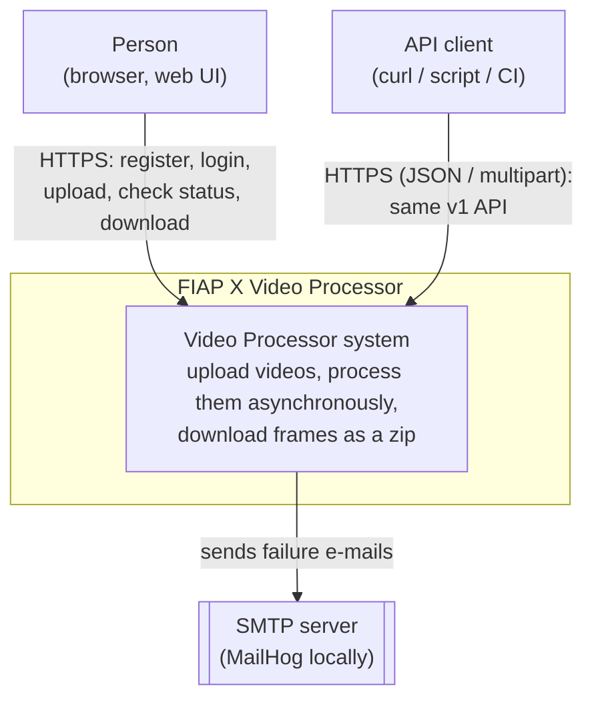
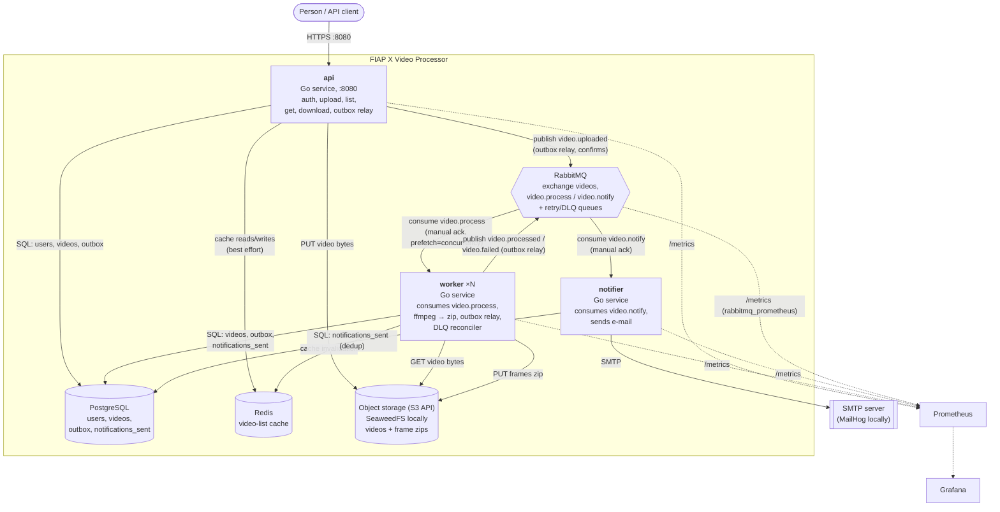
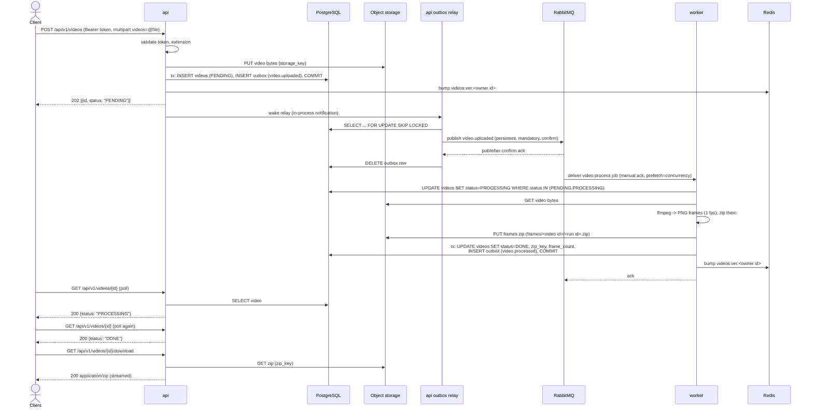
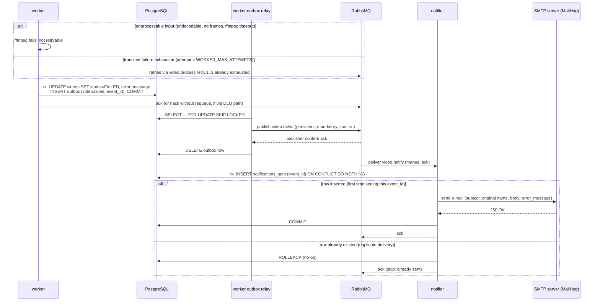
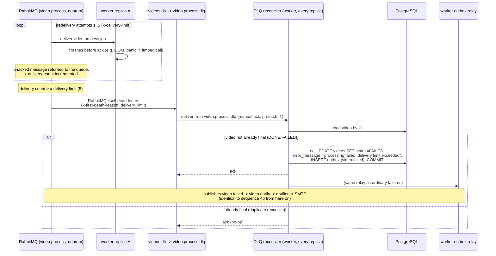
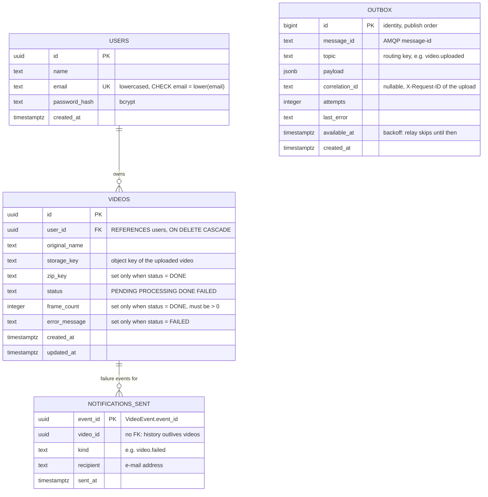

# Architecture

This is deliverable **D1**. It documents the *actual, implemented* system —
cross-checked against the code, the migrations, the RabbitMQ topology and
the other `docs/*.md` files — not the original proposal in
[`.ai-agents/PLAN.md`](../.ai-agents/PLAN.md) §4, which was written before
implementation and is superseded here where the two differ (see the note at
the end of §3).

For the requirements and deliverables this system satisfies, see
[`.ai-agents/PLAN.md`](../.ai-agents/PLAN.md#2-requirements-from-the-pdf);
for the up-to-date status of each, its
[requirement traceability table](../.ai-agents/PLAN.md#7-requirement-traceability).
The decisions summarized in §3 are recorded in full in [`docs/adr/`](adr/).

## 1. Context (C4 level 1)

Two kinds of actor use the system, through the same HTTP API: a person
using the bundled web UI in a browser, and an API client (curl, a script, a
CI job) calling the JSON API directly. Both authenticate with the same
username/password + JWT flow (RF3) and see only their own videos (RF4).

The only external system is an SMTP server, used to notify a user by e-mail
when one of their videos fails to process (RF5). Locally and in CI this is
MailHog, which also exposes an HTTP API the integration tests use to assert
on the mail it received; in production it is any SMTP relay
([`docs/notifications.md`](notifications.md#configuration)).

## 2. Containers (C4 level 2)

Three Go services — **api**, **worker** (scaled out, ×N replicas) and
**notifier** — plus their infrastructure. Every arrow below is a real,
implemented communication path (not aspirational): the routing keys,
queues, ports and column names are the ones in
[`docs/messaging.md`](messaging.md), [`docs/database.md`](database.md) and
`internal/platform/config`.

Notes that matter for reading this diagram correctly:

- **api↔RabbitMQ and worker↔RabbitMQ are not direct publishes.** Both
  services write to their own PostgreSQL `outbox` table in the same
  transaction as the change they're announcing, and a relay goroutine in
  every replica of both services publishes from that table
  (§3, [ADR 0004](adr/0004-transactional-outbox.md)). The diagram's
  "publish ... (outbox relay)" labels reflect that indirection.
  `video.processed` is published but has no bound queue yet (reserved for a
  future consumer); `video.uploaded` and `video.failed` are mandatory
  messages, guaranteed not to be silently dropped.
- **worker↔Redis** exists because the worker also invalidates the video-list
  cache on every status change, not just the api ([`docs/cache.md`](cache.md)).
- Prometheus and Grafana form the observability container group: every
  service exposes `/metrics` (api on a separate internal port `:9090`;
  worker/notifier on their health port `:8081`; RabbitMQ via its own
  `rabbitmq_prometheus` plugin on `:15692`); Prometheus scrapes all of them
  and Grafana renders a provisioned dashboard from Prometheus. Full detail
  in [`docs/observability.md`](observability.md).

## 3. Key architectural decisions

**Single-module monorepo.** api, worker and notifier are three deployable
binaries but one Go module, sharing `internal/domain` (entities, statuses,
format validation) and `internal/app` (use cases, ports) without needing to
version an internal library across repos. `internal/domain` imports nothing
project-specific, `internal/app` depends only on `domain` and its own port
interfaces, and every concrete integration (Postgres, RabbitMQ, S3, SMTP)
lives behind an adapter that implements a port and never imports another
adapter. That boundary is what lets `docs/k8s/README.md`'s "managed
services later" table swap Postgres/RabbitMQ/S3/SMTP for managed
equivalents with a config change, not a code change. Full rationale:
[ADR 0002](adr/0002-repository-layout.md).

**Async processing via a queue, to satisfy RF1/RF2.** A synchronous
"upload → ffmpeg → respond" design (the original demo) processes one video
at a time and loses every request that arrives while ffmpeg is busy or the
process is restarting. Instead, `POST /api/v1/videos` only stores the file
and durably records the intent to process it, and returns `202` — the
actual work happens later, off the request path, picked up by a pool of
worker replicas that each hold up to `WORKER_CONCURRENCY` jobs at once. That
buys both requirements at once: more than one video processes at a time
because there is more than one worker (and more than one goroutine per
worker), and a load spike does not lose requests because accepting an
upload no longer depends on a worker being free — it only depends on
PostgreSQL and (briefly) object storage being up. The [load test in
`docs/loadtest/`](loadtest/README.md) evidences this end to end: a
5→30→5 req/s spike against `POST /api/v1/videos` produced 499/499 accepted,
0 rejected, and every accepted video was independently confirmed `DONE`
afterward.

**The transactional outbox, and why.** "Insert the video row, then publish
to RabbitMQ" is not atomic: a crash or broker hiccup between the two steps
either loses the job (never published) or queues a job for a video that
doesn't exist yet (published before the insert commits). Both api and
worker instead write the event (job or status-change notification) into a
PostgreSQL `outbox` table in the *same transaction* as the row it announces,
and a relay goroutine — running in every replica of both services — claims
due rows (`FOR UPDATE SKIP LOCKED`, so replicas don't double-publish),
publishes them with RabbitMQ publisher confirms, and only then deletes them.
This makes "queued" and "recorded" atomic without a distributed
transaction, keeps working (uploads still succeed) while RabbitMQ is down,
and gives at-least-once delivery — which is why the worker and notifier are
both written to be idempotent (§5, and
[`docs/messaging.md`](messaging.md#idempotency)). Full rationale, including
why publish-then-commit-with-reconciliation was rejected:
[ADR 0004](adr/0004-transactional-outbox.md).

**Object storage as S3, SeaweedFS as the local/dev backend.** Video bytes
and generated zips must live outside the api/worker containers for both to
scale horizontally and survive restarts (RT1, RT2) — local disk would tie
a file to whichever specific replica received the upload. The application
only ever talks to a generic S3 API (`github.com/minio/minio-go/v7`) behind
the `app.ObjectStorage` port; nothing in the code is SeaweedFS-specific.
SeaweedFS backs that port in compose/CI/k8s-dev because MinIO stopped
publishing container images the original plan assumed. Swapping in AWS S3
or MinIO-if-it-returns is a configuration change (`S3_ENDPOINT`, TLS,
credentials), not a code change. Full rationale:
[ADR 0003](adr/0003-object-storage-seaweedfs.md).

**Quorum queues with a delivery limit, closing the crash-loop gap.** The
worker's own retry logic (backoff through `video.process.retry.1..3`, give
up and mark `FAILED` after `WORKER_MAX_ATTEMPTS`) only runs if the worker's
handler gets to execute at all. A worker that crashes (OOM, panic, killed)
*before* acking — e.g. on every attempt at one poisonous input — leaves the
message unacked; on a classic RabbitMQ queue that message is redelivered
forever with no cap, so the video is stuck `PROCESSING` and its owner is
never notified, silently violating RF5. `video.process`, `video.notify` and
their retry/delay queues are declared as **quorum** queues with
`x-delivery-limit` (5 for `video.process`, 6 for `video.notify` — one more
than the application's own attempt ceiling, so it is strictly a backstop,
never the primary mechanism on a healthy consumer). Past that limit
RabbitMQ itself dead-letters the message, and a small dedicated consumer in
the worker (the **DLQ reconciler**) marks the video `FAILED` and emits the
same `video.failed` event the ordinary give-up path emits, so notification
still happens (§4c). The dead-letter queues themselves stay classic — they
are terminal inspection/replay queues, never touched by anything
crash-prone. Full rationale and the exact limits/queue list:
[ADR 0005](adr/0005-quorum-queues-delivery-limit.md), and the topology in
[`docs/messaging.md`](messaging.md#topology).

**The integration suite as the spec, and why that's a process decision,
not just a testing one.** Before any of the above existed, the repository
held 28 black-box tests describing a different, legacy contract (synchronous
processing, no auth, public file paths) inherited from the original demo.
Rather than retrofit that contract, [ADR 0001](adr/0001-replace-legacy-test-contract.md)
replaced it in two ordered phases — rewrite the tests for the *target*
v1 behavior first (every test starting `notImplemented(t)`, so the suite
stays green and doubles as an executable spec), then implement against
that fixed target, deleting each `notImplemented(t)` line in the same PR
that makes it pass. That decision is why the rest of this document can be
written with confidence: `tests/integration/` (with `docs/openapi.yaml`) is
the actual, currently-enforced contract, not a description of intent, and
CLAUDE.md's Ground rules keep it that way — code that disagrees with the
tests is what's wrong, not the reverse.

## 4. Sequence diagrams

### 4a. Upload → processing → download (happy path)

### 4b. Failure notification (RF5)

Two ways a job ends `FAILED` while its handler actually ran: the input
itself is unprocessable (no retry — it would fail again), or a transient
failure (storage/DB down) exhausts `WORKER_MAX_ATTEMPTS`. Both converge on
the same outbox → notifier → SMTP path.

### 4c. Crash-loop / dead-letter recovery (ADR 0005)

The gap this closes: a worker that crashes *before* it ever gets to run its
handler (e.g. on every delivery of one poisonous message) never runs its
own retry/give-up logic at all, so on a queue with no delivery cap the
message would redeliver forever and the video would stay `PROCESSING`
forever, un-notified. Quorum queues' own `x-delivery-limit` closes that,
and the DLQ reconciler finishes the job the crashed worker never started.

## 5. Data model

Four tables, all in one PostgreSQL database, created by the migrations in
[`db/migrations/`](../db/migrations/) (goose v3, embedded in the api
binary). This is the current schema (through migration `00004`); see
[`docs/database.md`](database.md) for the full DDL and how migrations run.

`outbox` and `notifications_sent` are not incidental bookkeeping — they are
how RF2 and RF5 are actually guaranteed (§3): `outbox` is what makes
"accepted" and "durably queued" the same fact, and `notifications_sent` is
what turns at-least-once delivery into "exactly one e-mail per failure"
([`docs/notifications.md`](notifications.md#exactly-one-e-mail)). Neither
has a foreign key to `videos` for its own reasons: `outbox` rows are
deleted once published (no long-lived reference needed), and
`notifications_sent` is a permanent audit log that must outlive a video
row if one is ever deleted.

**Invariants enforced as `CHECK` constraints** (not just application code —
so a bug or a manual `UPDATE` can't produce an inconsistent row):

- `videos.status` is one of `PENDING`, `PROCESSING`, `DONE`, `FAILED`
  (`domain.VideoStatus`'s only valid values); the allowed transitions
  themselves (`PENDING → PROCESSING → DONE|FAILED`, plus `PENDING →
  FAILED` directly, e.g. via the DLQ reconciler) are enforced by
  `domain.Video`/conditional `UPDATE ... WHERE status IN (...)` statements,
  not by a DB-level state machine.
- `videos_done_has_zip` / `videos_done_fields_together`: `zip_key` and
  `frame_count` are both set if and only if `status = 'DONE'` — a video
  can't be `DONE` without its archive, and can't have an archive while
  still `PENDING`/`PROCESSING`/`FAILED`.
- `videos_failed_has_error`: `error_message` is set if and only if
  `status = 'FAILED'`.
- `frame_count > 0` when present; `users.email = lower(email)` (case-
  insensitive uniqueness enforced by a unique index on the already-
  lowercased column); every `text` "required" field additionally has a
  `<> ''` check so an empty string can't stand in for NULL.

## 6. Deployment view

Every container above ships as its own multi-stage Docker image
(`deploy/docker/{api,worker,notifier}.Dockerfile`), runs as a non-root
user, and is composed together in [`deploy/docker-compose.yml`](../deploy/docker-compose.yml)
for local/CI use (`make up`) or as Kustomize manifests in
[`deploy/k8s/`](../deploy/k8s/) (`base` + `dev`/`prod` overlays, HPA, an
opt-in KEDA autoscaler on `video.process` queue depth) for a cluster. CI/CD
— image publishing to GHCR and the Kubernetes/VM deploy pipeline — is its
own concern and already documented; this document is about the logical and
application architecture, not the pipeline, so see
[`deploy/k8s/README.md`](../deploy/k8s/README.md) and
[`docs/deployment.md`](deployment.md) for the full detail instead of
repeating it here.

## 7. Requirements traceability

The authoritative, up-to-date record of which requirement is satisfied by
what, and its current status, is
[`.ai-agents/PLAN.md`'s requirement traceability table](../.ai-agents/PLAN.md#7-requirement-traceability) —
this section only calls out how the architecture above maps to the
functional/technical requirements, not their current pass/fail state.

- **RF1** (process more than one video at a time) and **RF2** (never lose a
  request during load peaks) are satisfied together by §3's async-queue
  design: the durable `video.process` queue, a worker pool (replicas ×
  `WORKER_CONCURRENCY`), the transactional outbox (§3, §4a) and the quorum
  queues' `x-delivery-limit` backstop (§3, §4c) — evidenced end to end by
  the spike load test in [`docs/loadtest/`](loadtest/README.md) (499/499
  accepted, 0 lost).
- **RF3** (username/password protection) is the bcrypt + JWT auth in api,
  enforced on every `/api/v1/videos*` route.
- **RF4** (list a user's videos) is `GET /api/v1/videos`/`GET
  /api/v1/videos/{id}`, scoped to the caller by `user_id`, backed by the
  `videos_user_created_idx` index and the Redis cache of §2/[`docs/cache.md`](cache.md).
- **RF5** (notify on error) is §4b/§4c end to end: the `video.failed` event,
  the notifier, and `notifications_sent` deduplication
  ([`docs/notifications.md`](notifications.md)).
- **RT1** (persist the data) is PostgreSQL (§5) for users/videos/outbox/
  notifications and S3-compatible object storage (§3) for video/zip bytes.
- **RT2** (scalable architecture) is every service being stateless and
  horizontally replicable (api/worker/notifier), the worker pool scaling
  independently of the api, and the k8s HPA/KEDA options in
  [`deploy/k8s/README.md`](../deploy/k8s/README.md).
- **RT3–RT5** (GitHub versioning, tests, CI/CD) are process/delivery
  concerns rather than architecture; see the plan's traceability table and
  [`docs/deployment.md`](deployment.md).
