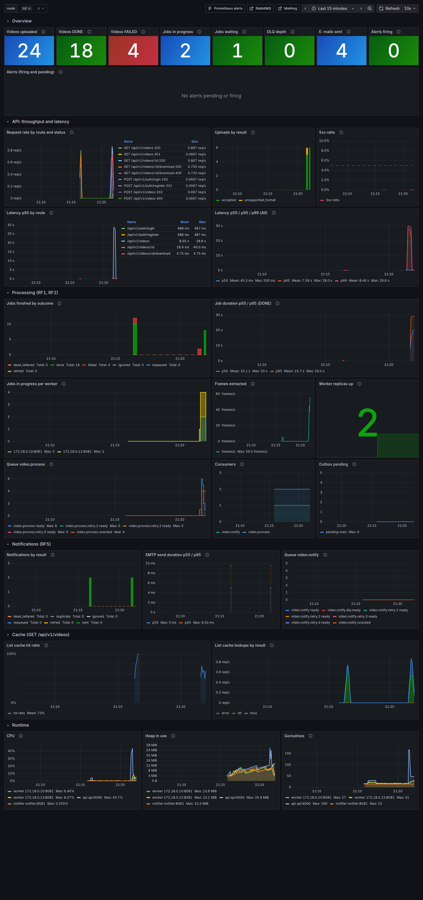

# Observability

## Logs

Every service (api, worker, notifier) writes **one JSON object per line** to
stdout through `log/slog` (`internal/platform/logging`). `LOG_LEVEL`
(`debug`, `info`, `warn`, `error`; default `info`) sets the minimum level.

### Fields

Every line has `time`, `level`, `msg` and `service` (`api`, `worker` or
`notifier`). The **correlation fields** are added from the context of the
line (`logging.ContextHandler`), so every line about one request or one
job carries them without each call site repeating them:

| field | where | meaning |
|---|---|---|
| `request_id` | api, worker, notifier | Correlation id: the `X-Request-ID` of the HTTP request, carried by every message it caused (see below). |
| `user_id` | api | Authenticated user of the request (routes behind a bearer token). |
| `video_id` | api, worker, notifier | Video of a `/api/v1/videos/{id}` route or of the message being handled. |
| `event_id` | notifier | Id of the `video.failed` / `video.processed` event being handled. |
| `message_id` | worker, notifier | AMQP message id (video id for jobs, event id for events). |
| `attempt` | worker, notifier | Delivery attempt of the message (1 = first, see [`messaging.md`](messaging.md)). |
| `queue` | worker, notifier | Work queue of the consumer. |
| `error` | any | The error, on `warn`/`error` lines. |

Use the context-aware methods (`log.InfoContext(ctx, ...)`,
`log.ErrorContext(ctx, ...)`, `log.LogAttrs(ctx, ...)`) so the fields are
added; `logging.WithAttrs(ctx, ...)` / `logging.WithRequestID(ctx, id)`
add fields for everything downstream. An attribute passed explicitly (or
bound with `Logger.With`) wins over the context's, so no key appears twice.

**Access log (api).** One line per request, `msg: "http request"`, with
`method`, `route` (the route pattern, e.g. `/api/v1/videos/:id`, never the
raw path: bounded cardinality and no ids in it; `unmatched` for 404s of
unknown paths), `status`, `duration_ms`, `bytes` (response body size),
`request_id` and, when authenticated, `user_id` (and `video_id` on the
`{id}` routes). Level: `info`; `error` for 5xx; `debug` for the probes
(`/healthz`, `/readyz`) and the web UI's static files (`/`, `/ui/*`). The
worker's and notifier's probe servers log the same way.

### Correlation id

The api takes the correlation id from the request header `X-Request-ID`
when it is 1 to 128 characters among letters, digits and `-_.:`
(`logging.ValidRequestID`); otherwise (missing, too long, other characters)
it generates a UUID. Either way it is echoed in the response header
`X-Request-ID` ([`openapi.yaml`](openapi.yaml)) and follows the upload:

```
client ──X-Request-ID: demo-123──▶ api
  api    request ctx: request_id=demo-123, user_id                 (access log, errors)
    │    INSERT outbox (…, correlation_id='demo-123')              (migration 00004)
    │    outbox relay ──AMQP correlation-id=demo-123──▶ video.process
    ▼
  worker consumer ctx: request_id, message_id, attempt, video_id   ("processing video", …)
    │    retry republish keeps correlation-id
    │    MarkDone/MarkFailed(ctx) → outbox event row inherits correlation_id
    │    outbox relay ──video.failed, correlation-id=demo-123──▶ video.notify
    ▼
  notifier consumer ctx: request_id, message_id, attempt, event_id, video_id
         ("failure e-mail sent", retries, give-up)
```

- The outbox (`postgres.enqueue`) stores the request id of the context that
  queues a message (the upload's in the api, the job's in the worker) in
  `outbox.correlation_id`; the relay publishes it as the standard AMQP
  `correlation-id` property (`rabbitmq.Publisher`).
- The consumer (`rabbitmq.Consumer`) restores it as `request_id`, with
  `message_id`, `attempt` and the body's `video_id` / `event_id`, into the
  context passed to the handler, so every line of the job has them.
- Messages without one (rows queued before migration 00004, or sent by
  other tools) are handled normally; their lines have no `request_id` but
  still `video_id` / `message_id`.

### Following one upload

```sh
curl -H "Authorization: Bearer $TOKEN" -H "X-Request-ID: demo-123" \
     -F videos=@good.mp4 -F videos=@corrupt.mp4 http://localhost:8080/api/v1/videos
docker compose -f deploy/docker-compose.yml logs --no-color | grep demo-123
```

```
api-1      | {"level":"INFO","msg":"http request","service":"api","method":"POST","route":"/api/v1/videos","status":202,"duration_ms":10.8,"bytes":451,"request_id":"demo-123","user_id":"bf08…"}
worker-1   | {"level":"INFO","msg":"processing video","service":"worker","video_id":"1c32…","original_name":"good.mp4","request_id":"demo-123","message_id":"1c32…","attempt":1}
worker-1   | {"level":"INFO","msg":"video processed","service":"worker","video_id":"1c32…","frames":2,"duration_ms":38.1,"request_id":"demo-123",…}
worker-2   | {"level":"INFO","msg":"video cannot be processed","service":"worker","video_id":"742c…","reason":"ffmpeg: …Invalid data…","request_id":"demo-123",…}
notifier-1 | {"level":"INFO","msg":"failure e-mail sent","service":"notifier","event_id":"44c0…","video_id":"742c…","request_id":"demo-123",…}
```

Without a client-provided id, take the one the api returned
(`curl -D -` shows the `X-Request-ID` response header), or grep by
`video_id`. With `jq`:
`docker compose -f deploy/docker-compose.yml logs --no-color --no-log-prefix | grep '^{' | jq 'select(.request_id=="demo-123")'`.

### Privacy

- Never logged: passwords, bearer tokens, the `Authorization` header,
  request or e-mail bodies, the JWT secret or other credentials. The access
  log has no headers, no query string and no raw path.
- **E-mail addresses are not logged**: users are identified by `user_id`
  (`owner_id` in the worker). Where an address could end up in a logged
  error (the mailer's "invalid recipient"), it is masked with
  `logging.MaskEmail` (`ana@example.com` → `a***@example.com`). Replies
  from the SMTP server are logged as the server sent them.
- The client IP is not logged.
- A client-provided `X-Request-ID` is logged only when it passes
  `logging.ValidRequestID`, so it cannot inject quotes, newlines or huge
  values into the logs or the message properties.

## Metrics

Every service exposes Prometheus metrics at `GET /metrics` (text format;
OpenMetrics when the scraper asks for it). Each service has its own
registry (`internal/platform/metrics`), never the global default one.

### Where they are served

| service | listener | notes |
|---|---|---|
| api | `METRICS_ADDR` (default `:9090`), `GET /metrics` only | A separate internal listener: the public port (`HTTP_ADDR`, 8080) answers `/metrics` with 404, so publishing the API never publishes the metrics. |
| worker | `HEALTH_ADDR` (default `:8081`), next to `/healthz` and `/readyz` | Already an internal listener (probes only). |
| notifier | `HEALTH_ADDR` (default `:8081`), next to `/healthz` and `/readyz` | Same as the worker. |
| rabbitmq | `:15692` (`rabbitmq_prometheus` plugin) | Queue depth; see below. |

`/metrics` has no authentication and is not in the access log (it is
served beside the Gin router, not through it). In compose the services'
metrics ports are **not published**: Prometheus scrapes them over the
compose network, and worker replicas have no fixed host port. RabbitMQ's
15692 is published on `127.0.0.1` only. By hand:

```sh
C="docker compose -f deploy/docker-compose.yml"
$C exec api wget -qO- http://127.0.0.1:9090/metrics | grep ^videoproc_
$C exec --index 2 worker wget -qO- http://127.0.0.1:8081/metrics | grep ^videoproc_jobs
$C exec notifier wget -qO- http://127.0.0.1:8081/metrics | grep ^videoproc_notifications
curl -s 'http://127.0.0.1:15692/metrics/detailed?family=queue_coarse_metrics' | grep 'queue="video.process"'
```

### Application metrics

Every name has the `videoproc_` prefix. Labels are **bounded**: fixed sets
of outcomes and results, HTTP route *patterns* (`/api/v1/videos/:id`, never
the raw path), never user ids, video ids, e-mail addresses or free text.
Unit tests check the label sets (`TestLabelsAreBounded`,
`TestMetricsCountRequestsByRoutePattern`). Series with a fixed label set
are exported at 0 from the start, so `rate()` and dashboards work before
the first event.

| metric | type | labels | service | meaning |
|---|---|---|---|---|
| `videoproc_build_info` | gauge (1) | `service`, `version` | all | Build of the service. `version` comes from the images' `VERSION` build arg (default `dev`). |
| `go_*`, `process_*` | | | all | Go runtime (goroutines, GC, memory) and process (CPU, RSS, open fds, start time) collectors. |
| `videoproc_http_requests_total` | counter | `method`, `route`, `status` | api | Requests served. `route` is the route pattern, `unmatched` for unknown paths; `method` is `OTHER` for non-standard methods. |
| `videoproc_http_request_duration_seconds` | histogram | `method`, `route` | api | Time to serve a request (5 ms to 5 min buckets: uploads and downloads can be long). |
| `videoproc_http_requests_in_flight` | gauge | | api | Requests being served. |
| `videoproc_uploads_total` | counter | `result` | api | `POST /api/v1/videos` requests that reached the handler (authenticated): `accepted`, or the error code of the rejection (`unsupported_format`, `missing_file`, `payload_too_large`, `invalid_request`, `internal`). |
| `videoproc_upload_bytes` | histogram | | api | Size of every accepted video file (64 KiB to 4 GiB buckets): `_count` = videos accepted, `_sum` = bytes. |
| `videoproc_list_cache_requests_total` | counter | `result` = `hit`, `miss`, `error` | api | Lookups of the video list cache ([`cache.md`](cache.md)), one per `GET /api/v1/videos`; `error`: Redis failed and Postgres answered. Absent when the cache is disabled. |
| `videoproc_outbox_pending` | gauge | | api, worker | Rows waiting in the outbox (ADR 0004), due or delayed after a failed publish; read at scrape time. The table is shared, so every relay reports the same value: aggregate with `max`. Left out of a scrape when Postgres is unreachable. |
| `videoproc_outbox_published_total` | counter | `result` = `ok`, `error` | api, worker | Messages this relay published (broker confirmed) or failed to publish (kept for a later pass). |
| `videoproc_jobs_total` | counter | `outcome` | worker | `video.process` deliveries handled, one outcome each (below). |
| `videoproc_job_duration_seconds` | histogram | `outcome` | worker | Time to handle one job: download, ffmpeg, zip, upload and status change (100 ms to 20 min buckets). |
| `videoproc_jobs_in_progress` | gauge | | worker | Jobs being handled by this worker (at most `WORKER_CONCURRENCY`). |
| `videoproc_frames_extracted_total` | counter | | worker | Frames of the videos that ended DONE. |
| `videoproc_notifications_total` | counter | `result` | notifier | `video.notify` deliveries handled, one result each (below). |
| `videoproc_notifications_in_progress` | gauge | | notifier | Events being handled by this notifier. |
| `videoproc_smtp_send_duration_seconds` | histogram | `result` = `ok`, `error` | notifier | Time of one SMTP send (10 ms to 30 s buckets). |

**Job outcomes** (`videoproc_jobs_total{outcome}`): the processor reports
the outcomes of the jobs it finishes, the consumer
(`rabbitmq.Consumer`) those of the jobs that fail
([`messaging.md`](messaging.md)):

| outcome | meaning |
|---|---|
| `done` | The video ended DONE. |
| `failed` | The video ended FAILED because of its content (undecodable, no frames, ffmpeg timeout, upload missing); no retry. |
| `ignored` | Nothing to do: unknown or already final video, or another delivery of the same job finished first. |
| `retried` | A transient failure; the job was sent to a retry queue. |
| `dead_lettered` | Sent to `video.process.dlq`: the last attempt failed (the video ends FAILED) or the message is malformed. |
| `requeued` | Put back in the queue: shutdown mid-job, or the outcome could not be recorded. |

Videos that ended FAILED = `failed` + the `dead_lettered` given up after
retries. **Notification results** (`videoproc_notifications_total{result}`):
`sent` (e-mail sent, including sent-but-not-recorded), `duplicate` (the
event was already notified), `ignored` (an event that is not notified),
and `retried`, `dead_lettered` (to `video.notify.dlq`) and `requeued` as
for jobs.

Where they are recorded (ADR 0002: `internal/app` does not import
Prometheus): the use cases report to small ports (`app.ProcessorMetrics`,
`app.OutcomeRecorder`, `internal/app/metrics.go`), the consumer to
`rabbitmq.Metrics`; `internal/adapters/prom` implements them and wraps the
outbox publisher, the mailer and the list cache; the HTTP middleware and
upload counters are in `internal/adapters/http/metrics.go`.

### Queue depth (RabbitMQ)

Queue depth comes from RabbitMQ's built-in Prometheus plugin
(`rabbitmq_prometheus`), enabled with the management plugin by
`deploy/rabbitmq/enabled_plugins` (mounted at
`/etc/rabbitmq/enabled_plugins`; the `rabbitmq:4-management` image enables
the same two by default). It listens on 15692, with no separate exporter:

| endpoint | content |
|---|---|
| `/metrics` | Node-wide totals only (`rabbitmq_queue_messages_ready` summed over all queues), cheap. |
| `/metrics/detailed?vhost=/&family=queue_coarse_metrics&family=queue_consumer_count` | **Per queue**: `rabbitmq_detailed_queue_messages_ready`, `rabbitmq_detailed_queue_messages_unacked`, `rabbitmq_detailed_queue_messages` and `rabbitmq_detailed_queue_consumers`, labeled `{vhost, queue}`, for `video.process`, `video.notify`, their `.retry.N` queues and the DLQs `video.process.dlq`, `video.notify.dlq`. This is the endpoint Prometheus scrapes for queue depth. |
| `/metrics/per-object` | Every metric per object (`rabbitmq_queue_messages_ready{queue=...}`, ...): same data, heavier. |

```
rabbitmq_detailed_queue_messages_ready{vhost="/",queue="video.process"} 2
rabbitmq_detailed_queue_messages_unacked{vhost="/",queue="video.process"} 0
rabbitmq_detailed_queue_consumers{vhost="/",queue="video.process"} 2
rabbitmq_detailed_queue_messages_ready{vhost="/",queue="video.process.dlq"} 0
```

## Prometheus

The compose stack runs Prometheus (`prom/prometheus:v3.5.0`) with
[`deploy/prometheus/prometheus.yml`](../deploy/prometheus/prometheus.yml)
and the alert rules of
[`deploy/prometheus/rules/`](../deploy/prometheus/rules/).

- **UI: <http://localhost:9091>** (`127.0.0.1:${PROMETHEUS_PORT:-9091}`).
  The host port is 9091, not Prometheus's usual 9090, so it is not mistaken
  for the api's internal metrics port (`api:9090`, never published). Useful
  pages: *Status → Targets* (`/targets`), *Alerts* (`/alerts`), *Query*.
- Scrapes every **5 s** (and evaluates the rules every 5 s): fast enough to
  watch a burst of uploads live. Retention is small (2 days, at most
  512 MB, `PROMETHEUS_RETENTION`), in the `prometheus-data` volume
  (`make down` removes it).
- After editing the config or the rules: `make obs-check`, then
  `curl -X POST http://localhost:9091/-/reload` (`--web.enable-lifecycle`)
  or `docker compose -f deploy/docker-compose.yml restart prometheus`.

### Scrape jobs

| job | target | path |
|---|---|---|
| `prometheus` | `localhost:9090` (itself) | `/metrics` |
| `api` | `api:9090` | `/metrics` |
| `worker` | every replica: `dns_sd_configs` with `names: [worker]`, `type: A`, `port: 8081`, refreshed every 5 s. Docker's DNS returns one A record per container of the `worker` service, so `--scale worker=N` adds or removes targets with no config change (`instance` is the replica's `ip:8081`). | `/metrics` |
| `notifier` | `notifier:8081` | `/metrics` |
| `rabbitmq` | `rabbitmq:15692` | `/metrics` (node totals) |
| `rabbitmq-queues` | `rabbitmq:15692` | `/metrics/detailed`, `params: {vhost: ["/"], family: [queue_coarse_metrics, queue_consumer_count]}` (per-queue depth and consumers) |

```sh
curl -s http://localhost:9091/api/v1/targets \
  | jq -r '.data.activeTargets[] | "\(.labels.job)\t\(.labels.instance)\t\(.health)"'
```

Useful queries: `sum by (outcome) (rate(videoproc_jobs_total[5m]))`,
`histogram_quantile(0.95, sum by (le) (rate(videoproc_job_duration_seconds_bucket[5m])))`,
`sum by (route) (rate(videoproc_http_requests_total{status=~"5.."}[5m]))`,
`rabbitmq_detailed_queue_messages_ready{queue="video.process"}`,
`max(videoproc_outbox_pending)`.

## Alerts

Rules: [`deploy/prometheus/rules/video-processor.yml`](../deploy/prometheus/rules/video-processor.yml),
checked by `make obs-check` (`promtool check config` and `check rules`,
run from the Prometheus image; CI runs it too). There is **no
Alertmanager** in the local stack: alerts are shown on
<http://localhost:9091/alerts> and on the dashboard (the *Alerts firing*
tile and the *Alerts* table). `severity: critical` means users are
affected now; `warning` needs a look.

| alert | severity | fires when |
|---|---|---|
| `ScrapeTargetDown` | critical | A target (`up == 0`) cannot be scraped for 1 min: a stopped or unreachable api, worker replica, notifier or RabbitMQ. A restarted worker is back well within the minute; a worker removed by `--scale` leaves the targets instead. |
| `NoWorkerConsumers` | critical | `video.process` has had no consumer for 1 min: uploads are accepted but stay `PENDING` (RF1). |
| `NoNotifierConsumers` | warning | `video.notify` has had no consumer for 2 min: failure e-mails are delayed (RF5). |
| `VideoProcessDLQNotEmpty` | warning | `video.process.dlq` has messages for 1 min: jobs given up after every retry, or malformed. |
| `JobFailureRatioHigh` | warning | Over 10 min, more than half of the finished jobs ended `FAILED` (at least 5 jobs), for 5 min. Corrupt uploads fail too, so the bar is high: it catches a worker that fails everything. |
| `JobRetriesHigh` | warning | More than 0.1 jobs/s go to a retry queue for 5 min (storage, database or broker errors). |
| `VideoProcessBacklog` | warning | More than 50 jobs wait in `video.process` for 10 min: add workers (RF2: nothing is lost, but videos wait). |
| `OutboxStuck` | critical | Outbox rows are pending and nothing has been published for 2 min (ADR 0004): uploads are recorded but not queued. |
| `OutboxBacklogGrowing` | warning | More than 100 rows pending and still growing, for 5 min. |
| `APIHighErrorRatio` | critical | More than 5% of the api requests (probes left out) are 5xx for 5 min, with at least 0.1 req/s. |
| `VideoNotifyDLQNotEmpty` | warning | `video.notify.dlq` has messages for 1 min: e-mails given up after ~21 min of retries. |
| `SMTPErrors` | warning | SMTP sends keep failing for 5 min (they are retried). |

To see one fire: `docker compose -f deploy/docker-compose.yml stop notifier`
→ after about a minute `ScrapeTargetDown{job="notifier"}` fires and
`NoNotifierConsumers` is pending (it fires after 2 min); `start notifier`
resolves both.

## Grafana



Grafana (`grafana/grafana:12.1.1`) is provisioned from
[`deploy/grafana/`](../deploy/grafana/), with nothing to click:

- `provisioning/datasources/prometheus.yml`: the Prometheus datasource
  (`uid: prometheus`, fixed: the dashboards reference it).
- `provisioning/dashboards/video-processor.yml`: loads every JSON of
  `dashboards/` into the *FIAP X* folder, re-read every 10 s.
- `dashboards/video-processor.json`: the **FIAP X Video Processor**
  dashboard (`uid: video-processor`), also the home dashboard.

**Open <http://localhost:3000>** (`127.0.0.1:${GRAFANA_PORT:-3000}`): the
dashboard opens read-only for anonymous visitors (Viewer role, a local-demo
setting; `GRAFANA_ANONYMOUS_ENABLED=false` turns it off). To edit, sign in
as `GRAFANA_ADMIN_USER` / `GRAFANA_ADMIN_PASSWORD` (development defaults
`admin` / `admin`, see `.env.example`). A provisioned dashboard cannot be
saved from the UI: edit the JSON (or export it from the UI with *Export →
Export as JSON*) and replace `dashboards/video-processor.json`. Direct
link: <http://localhost:3000/d/video-processor>.

Grafana makes no outbound calls (plugin preinstall, update checks, news and
usage reporting are disabled), so the stack runs offline.

### The dashboard

Default range: last 30 min, refresh 10 s. The `route` variable filters the
latency percentiles panel. Colors are consistent: DONE / `sent` / `hit`
green, FAILED red, `dead_lettered` orange-red, `retried` amber; 5xx
series red. Every panel has a description (the ⓘ next to its title).
Counts in the Overview tiles and the per-30 s bars are exact (differences
of the counters, not `increase()`, which extrapolates), so *Videos
uploaded* = *DONE* + *FAILED* + in progress + waiting once a burst is
accepted.

| row | panels | shows |
|---|---|---|
| **Overview** | Videos uploaded, Videos DONE, Videos FAILED (in the selected range), Jobs in progress, Jobs waiting (`video.process` ready), DLQ depth, E-mails sent, Alerts firing; the Alerts table (pending and firing) | The RF story at a glance. |
| **API: throughput and latency** | Request rate by route and status; Uploads by result (per 30 s); 5xx ratio (5% alert threshold dashed); Latency p95 by route; Latency p50 / p95 / p99 (`$route`) | RF2/RF3/RF4 traffic: uploads accepted or rejected, response times of each route. |
| **Processing (RF1, RF2)** | Jobs finished by outcome (per 30 s); Job duration p50 / p95 (DONE); Jobs in progress per worker (stacked, one series per replica); Frames extracted (frames/s); Worker replicas up; Queue `video.process` (ready, unacked, retry queues); Consumers; Outbox pending | Parallel processing across replicas, queue absorbing bursts, retries, the outbox relay. |
| **Notifications (RF5)** | Notifications by result (per 30 s); SMTP send duration p50 / p95; Queue `video.notify` (ready, unacked, retries, DLQ) | Failure e-mails. |
| **Cache** | List cache hit ratio; lookups by result | The Redis cache of `GET /api/v1/videos` ([`cache.md`](cache.md)). |
| **Runtime** | CPU (100% = one core), heap in use, goroutines, per service instance | Resource use of api, workers and notifier. |

### Demo: RF1 and RF2 live

1. `make up` (the whole stack, Prometheus and Grafana included) and open
   <http://localhost:3000>.
2. Sign up and upload a burst of videos in one go (the web UI at
   <http://localhost:8080> accepts several files, or `curl -F videos=@a.mp4
   -F videos=@b.mp4 …`). Videos of a minute or more keep the workers busy
   long enough to see them.
3. Watch: *Jobs waiting* jumps and drains, *Jobs in progress per worker*
   shows every replica busy at once (2 replicas × `WORKER_CONCURRENCY` 2 =
   4 jobs in parallel), *Jobs finished by outcome* fills with green (DONE)
   and red (corrupt files: FAILED), and *E-mails sent* counts one failure
   e-mail per FAILED video (in MailHog, <http://localhost:8025>).
4. Scale out while jobs are waiting:
   `docker compose -f deploy/docker-compose.yml up -d --scale worker=4`.
   Within about 10 s the new replicas appear in Prometheus (*Status →
   Targets*, job `worker`), *Worker replicas up* shows 4, *Consumers* on
   `video.process` goes to 4 and *Jobs in progress per worker* gets new
   series. Scale back with `--scale worker=2`: the targets leave again (no
   `ScrapeTargetDown`).
5. Stop a worker mid-burst (`docker compose -f deploy/docker-compose.yml
   restart worker`): in-flight jobs finish within `WORKER_SHUTDOWN_TIMEOUT`
   or go back to the queue and are finished by another replica; no video is
   lost (RF2).

### Why Prometheus and Grafana start by default

They are ordinary services of `deploy/docker-compose.yml`, not behind a
compose profile, so `make up` gives the full demo and the integration suite
starts them too. They start in parallel with the rest of the stack and are
healthy in a few seconds (Grafana ~5 s): measured locally, `up -d --wait`
of the whole stack took 8.3 s with them and 8.3 s without them. They need
no other service to start (a target that is not up yet is just `down` until
it is), and only Grafana waits for Prometheus to be healthy.
